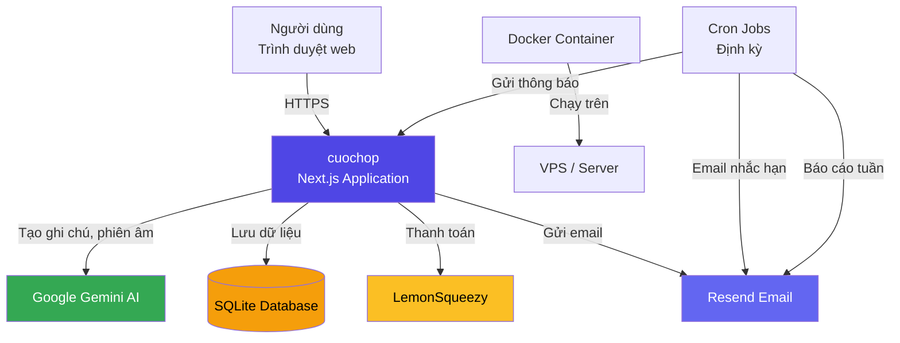
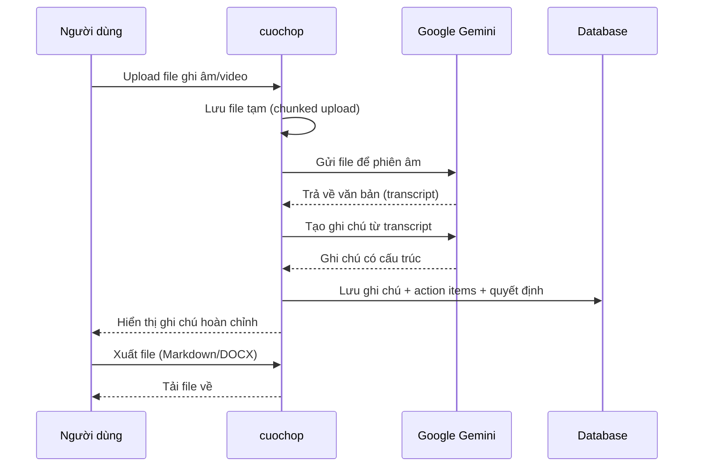
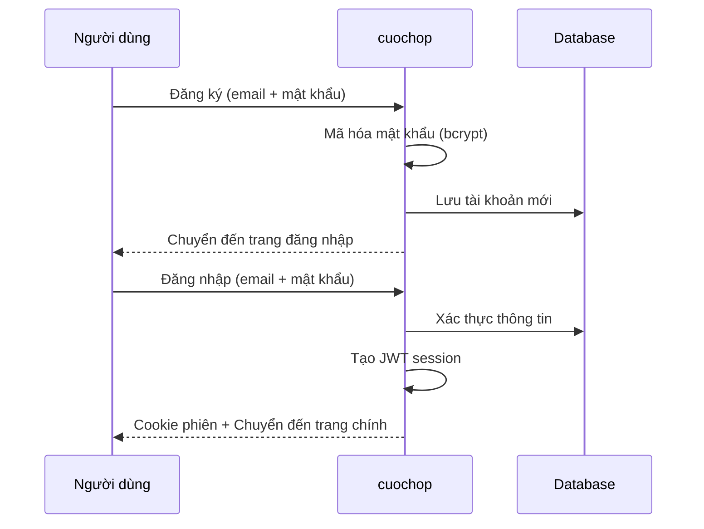
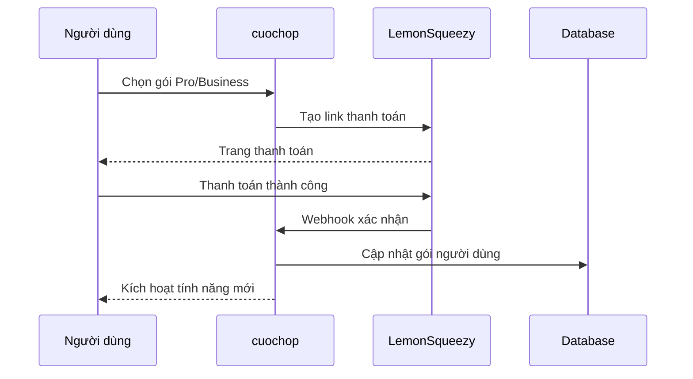
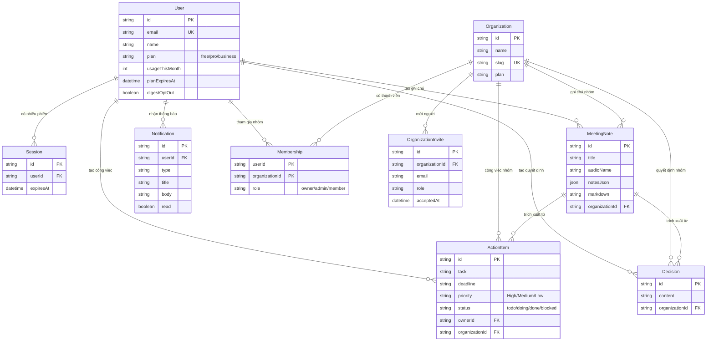
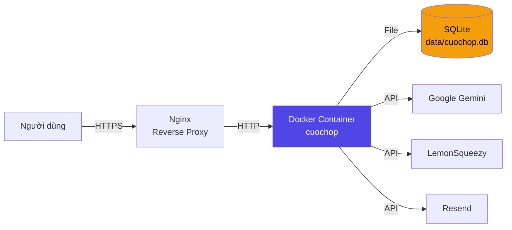

# Kiến trúc hệ thống cuochop

> Tài liệu kiến trúc cho đội ngũ quản lý và phát triển.
> Cập nhật lần cuối: 01/06/2026

---

## 1. Tổng quan sản phẩm

**cuochop** là ứng dụng SaaS tạo ghi chú cuộc họp tự động bằng trí tuệ nhân tạo (AI), dành cho thị trường Việt Nam.

**Vấn đề giải quyết:** Sau mỗi cuộc họp, người tham gia phải ghi chép tay, dễ bỏ sót quyết định và công việc được giao. cuochop tự động chuyển đổi file ghi âm/video cuộc họp thành ghi chú có cấu trúc, bao gồm tóm tắt, quyết định, và danh sách công việc cần làm.

**Đối tượng người dùng:**
- Cá nhân/tổ chức cần ghi chú cuộc họp bằng tiếng Việt
- Quản lý theo dõi công việc từ cuộc họp
- Đội nhóm cần chia sẻ action items và theo dõi tiến độ

**Cấp độ dịch vụ:**

| Tính năng | Free | Pro ($19/tháng) | Business |
|---|:---:|:---:|:---:|
| Tạo ghi chú/tháng | 5 | Không giới hạn | Không giới hạn |
| Xuất Markdown | Có | Có | Có |
| Xuất DOCX | - | Có | Có |
| Lịch sử cuộc họp | - | Có | Có |
| Bảng quản lý công việc | - | Có | Có |
| Không gian nhóm | - | - | Có |
| Bảng công việc chung | - | - | Có |
| Báo cáo tuần cho quản lý | - | - | Có |

---

## 2. Kiến trúc tổng quan

Hệ thống được xây dựng theo kiến trúc **monolith** trên nền tảng Next.js, giúp đơn giản hóa triển khai và bảo trì.

**Giải thích đơn giản:**
- **Người dùng** truy cập ứng dụng qua trình duyệt web
- **cuochop** là ứng dụng chính, xử lý tất cả logic nghiệp vụ
- **Google Gemini AI** là "bộ não" thực hiện phiên âm và tạo ghi chú
- **SQLite** là cơ sở dữ liệu lưu trữ mọi thông tin (người dùng, ghi chú, công việc)
- **LemonSqueezy** xử lý thanh toán quốc tế
- **Resend** gửi email thông báo và báo cáo
- **Cron Jobs** chạy định kỳ để nhắc hạn và gửi báo cáo tuần

---

## 3. Các module chính

### 3.1. Tạo ghi chú AI (AI Meeting Notes)

**Chức năng:** Chuyển đổi file ghi âm/video cuộc họp thành ghi chú có cấu trúc.

**Luồng hoạt động:**
1. Người dùng upload file âm thanh/video (MP3, MP4, WAV, M4A)
2. Hệ thống phiên âm bằng AI (nhận diện giọng nói, gán nhãn người nói)
3. AI tạo ghi chú có cấu trúc: tóm tắt, điểm thảo luận chính, quyết định, công việc, rủi ro
4. Người dùng có thể xuất ra Markdown hoặc DOCX

**Giá trị business:** Tiết kiệm 30-60 phút ghi chép sau mỗi cuộc họp.

### 3.2. Xác thực & Quản lý phiên (Authentication)

**Chức năng:** Đăng ký, đăng nhập, quản lý phiên làm việc.

**Cách hoạt động:**
- Người dùng đăng ký bằng email + mật khẩu
- Khi đăng nhập, hệ thống tạo "phiên" (session) lưu trong cookie trình duyệt
- Phiên có hiệu lực 30 ngày, tự động gia hạn khi sử dụng
- Middleware bảo vệ các trang yêu cầu đăng nhập

**Giá trị business:** Bảo mật tài khoản người dùng, hỗ trợ billing theo user.

### 3.3. Thanh toán & Gói dịch vụ (Billing & Plans)

**Chức năng:** Quản lý 3 cấp độ dịch vụ Free/Pro/Business.

**Cách hoạt động:**
- Người dùng chọn gói trên trang Pricing
- Hệ thống tạo link thanh toán qua LemonSqueezy (hỗ trợ thẻ tín dụng, PayPal)
- Khi thanh toán thành công, webhook cập nhật gói cho người dùng
- Khi hủy, hệ thống ghi nhận ngày hết hạn để downgrade đúng thời điểm
- Sử dụng mỗi tháng được reset tự động

**Giá trị business:** Tạo doanh thu từ sản phẩm, phân tầng người dùng theo nhu cầu.

### 3.4. Theo dõi công việc (Action Tracking) - Gói Pro

**Chức năng:** Trích xuất và theo dõi công việc từ cuộc họp.

**Cách hoạt động:**
- Khi tạo ghi chú, AI tự động trích xuất danh sách công việc (action items) và quyết định
- Mỗi công việc có: người phụ trách, hạn chót, mức ưu tiên, trạng thái
- Bảng quản lý công việc (Action Board) cho phép cập nhật trạng thái theo Kanban
- Báo cáo tóm tắt cho quản lý (Manager Digest)

**Giá trị business:** Đảm bảo công việc từ cuộc họp được theo dõi đến hoàn thành.

### 3.5. Không gian nhóm (Team Workspaces) - Gói Business

**Chức năng:** Quản lý nhóm làm việc chung.

**Cách hoạt động:**
- Quản lý tạo tổ chức (organization) với tên và slug duy nhất
- Mời thành viên qua email
- Phân quyền: Owner (chủ), Admin (quản trị), Member (thành viên)
- Công việc và ghi chú có thể chia sẻ trong nhóm

**Giá trị business:** Phù hợp đội nhóm, tăng giá trị khách hàng.

### 3.6. Email & Thông báo (Notifications)

**Chức năng:** Gửi thông báo và email tự động.

**Loại thông báo:**
- **Thông báo trong ứng dụng:** Hiển thị trên chuông (bell icon)
- **Email nhắc hạn:** Nhắc khi công việc sắp đến hạn (2 ngày trước)
- **Báo cáo tuần:** Gửi cho quản lý vào đầu tuần, tóm tắt công việc đội
- **Email giao việc:** Thông báo khi được giao công việc mới

**Giá trị business:** Đảm bảo người dùng không bỏ lỡ công việc quan trọng.

### 3.7. Xuất ghi chú (Export)

**Chức năng:** Xuất ghi chú cuộc họp ra file.

**Định dạng:**
- **Markdown:** Miễn phí, có thể dùng ngay
- **DOCX:** Gói Pro, file Word chuyên nghiệp

**Giá trị business:** Người dùng có thể chia sẻ ghi chú qua email, lưu trữ, hoặc in ấn.

---

## 4. Luồng dữ liệu chính

### 4.1. Tạo ghi chú cuộc họp

### 4.2. Đăng ký & Đăng nhập

### 4.3. Thanh toán nâng cấp gói

---

## 5. Cơ sở dữ liệu

Hệ thống sử dụng **SQLite** - cơ sở dữ liệu nhẹ, file-based, không cần cài đặt server riêng.

### Sơ đồ quan hệ

### Giải thích các bảng chính:

| Bảng | Mô tả |
|---|---|
| **User** | Tài khoản người dùng, lưu thông tin cá nhân và gói dịch vụ |
| **Organization** | Nhóm/tổ chức làm việc chung |
| **Membership** | Quan hệ giữa người dùng và tổ chức (vai trò) |
| **MeetingNote** | Ghi chú cuộc họp đã tạo |
| **ActionItem** | Công việc được trích xuất từ cuộc họp |
| **Decision** | Quyết định được trích xuất từ cuộc họp |
| **Session** | Phiên đăng nhập đang hoạt động |
| **Notification** | Thông báo trong ứng dụng |
| **OrganizationInvite** | Lời mời tham gia tổ chức |

---

## 6. Tech Stack

Công nghệ sử dụng trong dự án:

| Thành phần | Công nghệ | Giải thích |
|---|---|---|
| **Framework** | Next.js 16 | Framework web toàn diện, xử lý cả giao diện và server |
| **Giao diện** | React 19 + Tailwind CSS v4 | Thư viện UI phổ biến nhất + CSS utility |
| **Ngôn ngữ** | TypeScript | JavaScript với kiểm tra kiểu dữ liệu, giảm lỗi |
| **Cơ sở dữ liệu** | SQLite (Prisma ORM) | Nhẹ, không cần server, phù hợp khởi đầu |
| **AI** | Google Gemini | Model AI cho phiên âm và tạo ghi chú tiếng Việt |
| **Thanh toán** | LemonSqueezy | Xử lý thanh toán quốc tế (thẻ, PayPal) |
| **Email** | Resend | Dịch vụ gửi email transactional |
| **Xác thực** | jose + bcryptjs | Mã hóa JWT + hash mật khẩu |
| **Validation** | Zod | Kiểm tra dữ liệu đầu vào |
| **Testing** | Vitest | Framework kiểm thử nhanh |
| **Triển khai** | Docker | Đóng gói ứng dụng, dễ deploy |

---

## 7. Triển khai (Deployment)

Ứng dụng được đóng gói dưới dạng **Docker container** và triển khai trên VPS.

**Quy trình triển khai:**
1. Code được đẩy lên GitHub
2. Trên VPS, pull code và chạy `docker compose up`
3. Docker tự động build ứng dụng, chạy migration database
4. Nginx reverse proxy chuyển traffic từ domain vào container
5. Cron jobs chạy định kỳ qua endpoint API (được gọi bởi external scheduler hoặc internal)

**Lưu ý:** SQLite lưu dữ liệu trực tiếp trong container, cần mount volume để giữ dữ liệu khi restart.

---

## 8. Bảo mật

| Lớp bảo mật | Triển khai |
|---|---|
| **Mật khẩu** | Mã hóa bcrypt (hash một chiều, không thể giải mã) |
| **Phiên đăng nhập** | JWT ký bằng secret, lưu trong cookie HttpOnly |
| **API** | Kiểm tra quyền theo gói dịch vụ (Free/Pro/Business) |
| **Webhook** | Xác thực chữ ký từ LemonSqueezy |
| **Cron** | Xác thực bằng secret key riêng |
| **Upload** | Giới hạn kích thước, kiểm tra định dạng file |

---

*Mọi thắc mắc về kiến trúc, vui lòng liên hệ đội phát triển.*
